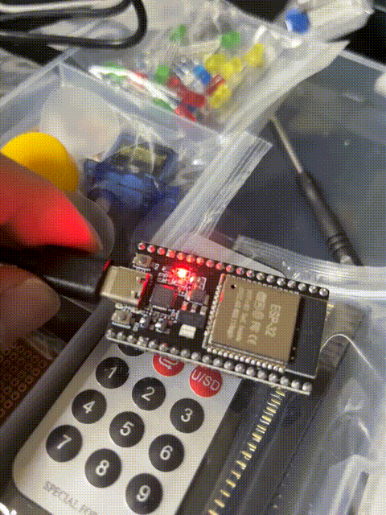
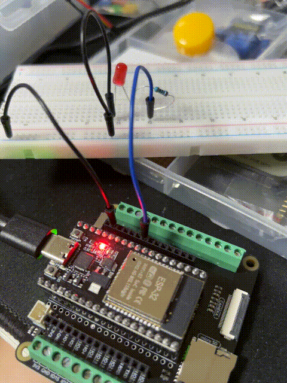

# ESP32 Playground

## Step 1 : Blink an internal LED(pin 2)

## Step 2 : Blink an external LED through a resistor (pin 26)

## Step 3 : Fading LED

## Step 4 : Colorful light

## Step 5 : Segment Display with 74HC595

## Step 6 : Digital-LCD

## Step 7 : Neopixel-strip

## Step 8 : Buzzer

https://github.com/user-attachments/assets/ac5bf2c7-8472-4f02-84d6-c0dc1ba26711

## Step 9 : Buzzer with Custom Tone

https://github.com/user-attachments/assets/5f8e8a36-a086-45a8-8662-5d19ffe92f66

## Step 10,11 : Motor

## Step 12 : Water Pump

## Step 13 : Servo